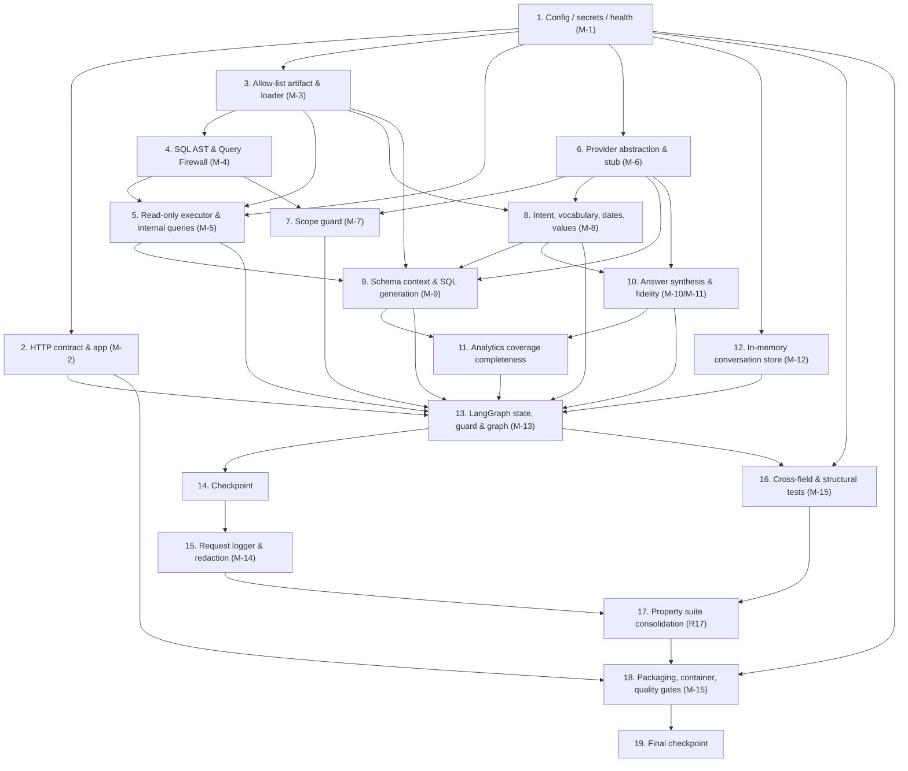

# Implementation Plan: hse-llm-chatbot-api

## Overview

This plan converts the approved design into incremental Python coding tasks, ordered along the design's Implementation Milestones M-1…M-15, which are already dependency-sorted. Each task writes, modifies or tests code, configuration or build files in this repository. Every task cites the acceptance criteria it implements using the `R<req>.<criterion>` notation and, where useful, the design section by name.

Language and stack follow the design: Python 3.13, FastAPI + Mangum, psycopg 3 + `psycopg_pool`, LangGraph, pydantic / pydantic-settings, sqlglot, and Hypothesis (dev group) for property tests. External items the design depends on (OQ-9 `llm_read` grant, OQ-12 provider account, OQ-15 network path) are exercised only through code seams tested against the stub provider and stub warehouse; no live provisioning or deployment is a task here.

Test-double convention (design §Test doubles): the `StubProvider` (one canned output per `CallType`, invocation counts, undeclared-type failure, may return firewall-violating SQL), `StubWarehouse` (one declared outcome per statement, records statement text/count, ≤20 rows), `FrozenClock` and `SecretStoreStub` are built early because nearly everything is tested against them. Response streaming stays out of MVP scope: `POST /chat/message` returns one complete verified JSON body; no SSE, response-streaming or stream route tasks appear here.

Property tests are tagged `# Feature: hse-llm-chatbot-api, Property {n}: {property_text}` and declare `@settings(max_examples=100, deadline=None)`, per design §Global policies.

Tasks marked `*` are optional test sub-tasks that may be skipped for a faster MVP; core implementation sub-tasks are never marked optional.

## Tasks

- [x] 1. Configuration, secrets and health foundation (M-1)
  - [x] 1.1 Create the `src/kognit_llm/` package skeleton with `__init__.py` files for every subpackage in the design §Package tree (`api`, `agent`, `agent/nodes`, `safety`, `nlu`, `sqlgen`, `schema`, `data`, `providers`, `answer`, `memory`, `observability`, `config`), each with an `__all__` placeholder to support the ≤7-public-name rule
    - _Requirements: R16.34_
    - Design: §Package tree
  - [x] 1.2 Implement `config/settings.py` with the frozen `Settings` (pydantic-settings, `env_prefix="KOGNIT_LLM_"`), one field per row of the R15 configuration table with the tabled bounds and defaults, `@lru_cache get_settings()`, and `settings_from_mapping()` that builds the model from an explicit dict with no environment, AWS credentials or network access; perform no import-time I/O
    - _Requirements: R15.6, R15.7, R15.16, R15.17, R15.25, R15.26, R15.27, R1.14, R2.9, R3.9, R3.24, R3.30, R3.38, R4.10, R4.28, R4.33, R6.14, R6.37, R7.5, R7.23, R7.24, R7.33, R8.33, R9.7_
    - Design: §Settings shape, §Migration of the current `src/config.py`
  - [x] 1.3 Implement `config/crossfield.py` `validate_cross_field(settings)` enforcing the timeout-ordering and environment relations (statement < turn, provider < turn, connect+statement ≤ turn, turn+2000 ≤ 29000, no aws+DEBUG, no aws+stub, no aws+`*` CORS, pool_min ≤ pool_max), returning one aggregated report naming every offending key without echoing secret values; wire it as the `Settings` `model_validator`
    - _Requirements: R10.27, R10.28, R11.31, R13.33, R14.36, R15.18, R16.19, R16.20_
    - Design: §Cross-field validation
  - [ ]* 1.4 Write unit tests for `Config_Loader`: default values per field, out-of-range rejection producing one aggregated multi-key error, secret values never echoed, `settings_from_mapping` builds with no environment
    - _Requirements: R15.16, R15.18, R15.25, R15.26_
  - [x] 1.5 Implement `config/secrets.py` `SecretResolver` with env-first → SSM (`…_PARAM`) → Secrets Manager precedence, `DbCredentials` value object, resolution bounded to ≤2 store requests / 1000 ms, resolved values cached per execution environment and published to the redactor as an opaque set; a full miss sets a failed dependency status without crashing
    - _Requirements: R7.8, R7.9, R7.10, R13.29, R13.30, R15.21, R15.22, R15.23, R15.24, R16.23_
    - Design: §Secret resolution precedence
  - [ ]* 1.6 Write unit tests for `SecretResolver` against `SecretStoreStub`: env-first zero-AWS path, SSM hit, Secrets Manager hit, full miss → failed status, request-count and no-secret-echo guarantees
    - _Requirements: R15.21, R15.23, R15.24_
  - [x] 1.7 Implement `health.py` composing configuration, warehouse, provider-configuration and schema-verification statuses without raising and without echoing connection details
    - _Requirements: R1.19, R7.10, R15.24, R15.31_
    - Design: §Migration of the current `src/config.py`, §Configuration and Packaging

- [x] 2. HTTP contract, app assembly and Mangum handler (M-2)
  - [x] 2.1 Implement `api/models.py` Pydantic `ChatRequest` (extra ignored, `message` min length 1, `conversation_id` pattern), `ChatResponse` (`user_id` literal `DEMO`, enumerated `intent` and `scope_decision`, `query_executed` excluded when `None`), `ErrorBody`, and the `message` NFC-normalize + trim + length field validator reading `settings.message_max_chars`
    - _Requirements: R1.2, R1.4, R1.5, R1.7, R1.8, R1.9, R1.10, R1.11, R1.13, R1.15_
    - Design: §HTTP contract models
  - [x] 2.2 Implement `api/app.py` `create_app(settings)` returning `FastAPI(root_path="/llm")`, registering routers and middleware, and publishing the OpenAPI schema describing the request/response bodies and status codes 200, 400, 415, 422, 503, 504
    - _Requirements: R1.1, R1.16_
    - Design: §Module responsibilities
  - [x] 2.3 Implement `api/routes_health.py`: `GET /health` (and `/llm/health`) reporting warehouse-connectivity and model-provider-configuration statuses, and `GET /` service-identity route returning `{service, service_version, environment}`; neither route emits a chat request-log entry
    - _Requirements: R1.18, R1.19, R15.15, R15.31_
    - Design: §HTTP contract models (placeholder routes)
  - [x] 2.4 Implement `api/middleware.py`: `request_id` and `correlation_id` generation, 16384-byte body cap (413), per-IP rate limit and in-flight concurrency bound (429), CORS allow-list, and the accepted-and-ignored `Authorization` auth seam
    - _Requirements: R1.15, R1.17, R13.10, R13.20, R13.21, R13.22, R13.34, R14.34, R14.35_
    - Design: §Module responsibilities, §Request path
  - [x] 2.5 Implement `api/errors.py` exception → HTTP mapping and the `LlmApiError` hierarchy (Configuration/RequestValidation/Scope/Clarification/IntentUnresolved/Firewall/Provider/Warehouse/TurnTimeout/GraphInvariant), each carrying `error_category`, `http_status`, `outcome` and a fixed per-category user message so two failures of one category differ only by `request_id`
    - _Requirements: R1.3, R1.20, R1.21, R1.22, R13.9, R13.32_
    - Design: §Error Handling
  - [x] 2.6 Modify `src/main.py`: keep the only dual-root import shim, build `app = create_app(get_settings())` and `handler = Mangum(app, api_gateway_base_path="/llm")`; remove the placeholder `GET /items/{item_id}` route and retain `GET /`
    - _Requirements: R1.1, R15.14, R15.27, R15.36_
    - Design: §Configuration and Packaging (`src/main.py`)
  - [x] 2.7 Remove the obsolete placeholder-route test for `GET /items/{item_id}` from `tests/unit/test_main.py` and adjust remaining assertions to the retained `GET /` and `GET /health`
    - _Requirements: R1.18_
  - [ ]* 2.8 Write component/contract tests through `TestClient`: 200/400/415/422 bodies each carrying `request_id`, malformed-JSON and wrong-content-type handling, `conversation_id` format rejection, `Authorization` accepted-and-ignored, and OpenAPI status-code presence
    - _Requirements: R1.3, R1.4, R1.5, R1.16, R1.17, R1.20, R1.21, R1.22_
  - [x] 2.9 Establish the test harness: `tests/conftest.py` with the session-scoped autouse no-sockets fixture, the shared Hypothesis profile (`max_examples=100, deadline=None`), and `settings_from_mapping`-based settings; create empty `tests/unit`, `tests/property`, `tests/component`, `tests/contract`, `tests/structural` packages
    - _Requirements: R15.26, R16.32, R17.29_
    - Design: §Global policies

- [x] 3. Approved schema allow-list artifact and loader (M-3)
  - [x] 3.1 Author `schema/allowlist.yaml` with the version identifier, `approved_schema`, the 10-function allow-list, and the exact table/column/measure/enumerate entries of the design artifact; exclude `dim_text_event` and `fact_incidents.sk_text_event` by construction
    - _Requirements: R4.1, R4.2, R4.3, R4.4, R4.5, R4.6, R4.7, R4.13, R4.34, R6.32_
    - Design: §Approved schema allow-list artifact
  - [x] 3.2 Implement `schema/allowlist.py` with `TableEntry`, `AllowList`, YAML loader carrying the version, per-table column scoping, `has_table`, `has_column`, and `resolve_unqualified` (exactly one owner → that table; more than one → None), plus the `verified`/`absent`/`unverified` states
    - _Requirements: R4.1, R4.2, R4.13, R4.16, R4.19, R4.20, R4.21, R4.22_
    - Design: §Approved schema allow-list artifact
  - [x] 3.3 Implement `schema/join_graph.py` encoding the star-schema surrogate-key edges and the `record_no` degenerate-dimension edges handed to the generator
    - _Requirements: R4.11_
    - Design: §Star-schema join graph handed to the generator
  - [ ]* 3.4 Write unit tests for the loader: version read, per-table column scoping (a column allow-listed for one table absent for another), `resolve_unqualified` single/multi-owner behaviour, and absence of `dim_text_event`
    - _Requirements: R4.2, R4.6, R4.19, R4.34_

- [x] 4. SQL AST adapter and Query Firewall (M-4)
  - [x] 4.1 Implement `safety/reason_codes.py` `RejectionReason` StrEnum with exactly the 24 codes of R6.41
    - _Requirements: R6.41_
    - Design: §`Query_Firewall` interface
  - [x] 4.2 Implement `safety/sql_ast.py` adapter over sqlglot (`read="postgres"`) exposing `tokenize(sql) -> list[SqlToken]` and `parse(sql) -> SqlTree` in project-owned types, with the placeholder normalization to an analysis copy (`%s` → `:p{n}` outside literals) and the `find_data_modifying_cte` / `find_nested_dml` walkers; import no provider client and no DB driver
    - _Requirements: R6.20, R6.21, R6.25, R6.26, R16.33_
    - Design: §SQL parser choice (expanded), §AST detection of data-modifying CTEs and nested DML
  - [x] 4.3 Implement `safety/firewall.py` `validate_sql(...)` as the deny-by-default ordered pipeline (checks 1–25 of the design), the `FirewallVerdict` (frozen, `statement_sha256`, reason set iff REJECT) and `FirewallLimits`; the module imports only `safety/sql_ast.py`, `hashlib` and project types
    - _Requirements: R6.1, R6.2, R6.3, R6.4, R6.5, R6.6, R6.7, R6.8, R6.9, R6.10, R6.11, R6.12, R6.13, R6.15, R6.16, R6.19, R6.22, R6.23, R6.24, R6.27, R6.28, R6.29, R6.30, R6.33, R6.34, R6.35, R6.36, R6.38, R6.39, R6.40, R6.42, R13.5, R16.33_
    - Design: §Query Firewall Design (check order)
  - [ ]* 4.4 Write property test for firewall soundness
    - **Property 1: Firewall soundness (allow-list invariant)**
    - **Validates: Requirements R6.3, R6.5, R6.10, R6.11, R6.12, R6.13, R6.19, R17.1**
  - [ ]* 4.5 Write property test for firewall rejection completeness
    - **Property 2: Firewall rejection completeness**
    - **Validates: Requirements R6.6, R6.7, R6.8, R6.23, R6.25, R6.26, R17.2**
  - [ ]* 4.6 Write property test for firewall determinism / idempotence
    - **Property 3: Firewall determinism / idempotence**
    - **Validates: Requirements R6.16, R6.42, R17.3**
  - [ ]* 4.7 Write property test for firewall false-positive freedom on string literals
    - **Property 11: Firewall false-positive freedom on string literals**
    - **Validates: Requirements R6.22, R17.11**
  - [ ]* 4.8 Write property test for allow-list closure
    - **Property 12: Allow-list closure**
    - **Validates: Requirements R4.6, R4.16, R4.19, R4.34, R6.10, R6.11, R17.12**
  - [ ]* 4.9 Write unit tests for the firewall hostile set and over-blocking set: the R17.35 hostile statements each rejected with the expected reason code, and the R17.36 over-blocking statements each admitted
    - _Requirements: R6.41, R17.35, R17.36_

- [x] 5. Read-only executor, pool, session, probes and internal queries (M-5)
  - [x] 5.1 Implement `data/errors.py` warehouse exception taxonomy (Unavailable, StatementTimeout, PrivilegeDenied, UndefinedObject, WriteRejected) translating driver exceptions so no message carries host, port, database, role, password or connection string
    - _Requirements: R7.19, R7.21, R7.27, R7.28, R7.29, R7.30, R7.34_
    - Design: §Read-only session and transaction, §Error Handling
  - [x] 5.2 Implement `data/session.py` `build_conninfo` (host/port/dbname/user/password/sslmode default `require`/connect_timeout/`options` setting `default_transaction_read_only=on` and `statement_timeout`) and `configure(conn)` setting `read_only=True`, `autocommit=False`
    - _Requirements: R7.1, R7.2, R7.3, R7.4, R7.20_
    - Design: §Read-only session and transaction
  - [x] 5.3 Implement `data/pool.py` `psycopg_pool` lifecycle with min/max size, acquisition timeout, `configure` hook, liveness check on checkout, and `open=False` (opened on first warehouse use, not at import)
    - _Requirements: R7.22, R7.23, R7.24, R7.25, R7.26, R16.21, R16.22_
    - Design: §Read-only session and transaction (pool)
  - [x] 5.4 Implement `schema/internal_queries.py` with the four static literals Q1 liveness, Q2 allow-list verification, Q3 privilege verification, Q4 dimension-value enumeration
    - _Requirements: R4.14, R4.25, R4.26, R4.27, R7.16, R7.25, R7.35_
    - Design: §Statically defined internal queries
  - [x] 5.5 Implement `data/probes.py` `probe_warehouse(pool)` and privilege/schema-verification probes using the internal queries, never raising and never echoing connection details, feeding `health.py`
    - _Requirements: R7.10, R7.17, R7.18, R16.25_
    - Design: §Migration of the current `src/config.py`
  - [x] 5.6 Implement `data/executor.py` `WarehouseExecutor` with `ResultSet`, `execute_admitted(statement, params, verdict)` that recomputes `sha256(statement)` and refuses unless it equals `verdict.statement_sha256` and `verdict.verdict == "ADMIT"`, opens a READ ONLY transaction, applies `statement_timeout`, fetches `row_cap + 1`, applies column and byte caps, sets `truncated`, records durations, and cancels in-flight statements within 1000 ms on turn timeout; expose no other caller-supplied-SQL entry point
    - _Requirements: R6.43, R6.44, R6.45, R6.46, R7.6, R7.7, R7.12, R7.13, R7.31, R7.32, R16.5, R16.6_
    - Design: §Read-only session and transaction (execution sequence)
  - [ ]* 5.7 Write unit tests for `Query_Executor` against `StubWarehouse`: hash-mismatch refusal, non-ADMIT refusal, `row_cap + 1` fetch with truncation flag, statement-timeout → TIMEOUT outcome, connection/auth/privilege/undefined-object failure classes, and no connection-detail leakage in messages
    - _Requirements: R6.45, R7.6, R7.7, R7.17, R7.19, R7.28, R7.30, R7.32, R7.34_

- [x] 6. Model provider abstraction and stub (M-6)
  - [x] 6.1 Implement `providers/base.py` `ModelProvider` Protocol with `Message`, `CompletionRequest[T]`, `CompletionResult[T]`, `CallType`, a shared `ProviderBase` mixin holding retry / repair / credential-refresh / token-ceiling / finish-reason policy, and `build_provider(settings, secrets)` factory in `providers/factory.py`
    - _Requirements: R11.1, R11.2, R11.6, R11.11, R11.12, R11.13, R11.15, R11.16, R11.17, R11.20, R11.21, R11.22, R11.24, R11.26, R11.28, R11.29, R11.33, R13.25_
    - Design: §`ModelProvider` protocol
  - [x] 6.2 Implement `providers/stub.py` `StubProvider` holding one canned output per `CallType`, counting invocations per call type, failing on an undeclared call type, returning identical output for identical requests and able to return firewall-violating SQL; make it importable by tests
    - _Requirements: R11.30, R17.30, R17.31, R17.32_
    - Design: §Test doubles
  - [x] 6.3 Implement `providers/openai_compatible.py` and `providers/bedrock.py` transport implementations behind the Protocol, both reusing `ProviderBase`; only these modules import a provider SDK
    - _Requirements: R11.1, R11.2, R11.23, R11.24, R16.33_
    - Design: §Key Design Decisions (D5), §Import boundaries
  - [ ]* 6.4 Write unit tests for the provider policy against a fake transport: retry-exhausted → 503 class, repair budget, `MAX_OUTPUT_TOKENS` twice, `CONTENT_FILTERED` branch, token-ceiling, and `stub` selected in `aws` environment rejected by config
    - _Requirements: R11.7, R11.17, R11.20, R11.21, R11.29, R11.31_

- [x] 7. Scope guard: deterministic stage plus model stage (M-7)
  - [x] 7.1 Implement `safety/scope_rules.py` with the Spanish/English lexicons and patterns for the unsafe categories (R2.8–R2.10, R2.13) and out-of-scope categories (R2.4–R2.7)
    - _Requirements: R2.4, R2.5, R2.6, R2.7, R2.8, R2.9, R2.10, R2.13_
    - Design: §Key Design Decisions (D12)
  - [x] 7.2 Implement `safety/scope_guard.py` `decide(...)` with the deterministic rule stage first (0 model calls, precedence UNSAFE → OUT_OF_SCOPE → IN_SCOPE), followed by at most one model-assisted `ScopeVerdict` call only when no deterministic category matched, failing closed to `OUT_OF_SCOPE` on an absent/invalid/out-of-set verdict
    - _Requirements: R2.15, R2.16, R2.17_
    - Design: §Structured output models, §Node contract table
  - [ ]* 7.3 Write property test for firewall independence from instructions (covers scope decision context-invariance and firewall rejection of unsafe SQL regardless of accompanying text)
    - **Property 4: Firewall independence from instructions**
    - **Validates: Requirements R6.18, R13.6, R13.27, R17.4**
  - [ ]* 7.4 Write unit tests for `Scope_Guard`: one request per out-of-scope category and per unsafe category with ≤1 model call, fail-closed default, and precedence when a message mixes categories
    - _Requirements: R2.4, R2.5, R2.6, R2.7, R2.8, R2.9, R2.10, R2.13, R2.16, R2.17_

- [x] 8. Intent classification, vocabulary, dates and value resolution (M-8)
  - [x] 8.1 Implement `nlu/dates.py` with `DateExpression`, the pure `resolve(expr, request_instant, tz, first_day_of_week)`, `clamp_to_request_date` and `default_range`, covering every row of the R3.29 table using `zoneinfo`
    - _Requirements: R3.8, R3.9, R3.10, R3.11, R3.29, R3.34, R3.35, R3.36, R3.37, R3.38_
    - Design: §Structured output models (dates), §Key Design Decisions (D11)
  - [ ]* 8.2 Write property test for relative-date round trip
    - **Property 8: Relative-date round trip**
    - **Validates: Requirements R3.10, R3.29, R3.35, R3.37, R17.8**
  - [x] 8.3 Implement `nlu/vocabulary.py` mapping Spanish/English terms to allow-listed attributes and category/severity/shift value mappings, and the Intelex severity-code mapping
    - _Requirements: R8.15, R8.16, R8.17, R8.18, R8.23_
    - Design: §Requirements Traceability (R3, R8)
  - [x] 8.4 Implement `nlu/value_resolver.py` performing case- and diacritic-insensitive (NFKD/casefold/mark-strip) folding of user terms against enumerated stored dimension values, binding the exact stored value; a miss yields the not-recognized signal and a plant/area double-match yields the ambiguous signal
    - _Requirements: R5.23, R8.11, R8.26, R8.27, R16.36_
    - Design: §Key Design Decisions (D9), §Open Questions Impacting Design (OQ-5)
  - [x] 8.5 Implement `nlu/intent.py` `Intent_Classifier` emitting `RawIntent` from one model call, converting to the seven-field `AnalyticsIntent` (dates resolved by `nlu/dates`, values by `nlu/value_resolver`), applying the confidence threshold gate, the grouping/filter bounds, the limit clamping, and context carry-over from the most recent retained `DATA_QUERY` intent
    - _Requirements: R3.1, R3.2, R3.3, R3.4, R3.5, R3.6, R3.7, R3.12, R3.13, R3.14, R3.15, R3.16, R3.17, R3.18, R3.19, R3.20, R3.21, R3.22, R3.23, R3.25, R3.26, R3.27, R3.28, R3.31, R3.32, R3.33_
    - Design: §Structured output models
  - [ ]* 8.6 Write unit tests for intent classification: measure defaulting to `incident_count`, week grouping recorded as derived, >3 groupings / >5 filters → CLARIFICATION_NEEDED, confidence-below-threshold → CLARIFICATION_NEEDED, elliptical carry-over overwrite/retain, and Spanish vocabulary mappings
    - _Requirements: R3.14, R3.16, R3.20, R3.22, R3.26, R8.15, R8.16, R8.17, R8.18_

- [x] 9. Schema context provider and SQL generation (M-9)
  - [x] 9.1 Implement `schema/context_provider.py` selecting allow-listed tables/columns reachable from the intent plus required join keys, enforcing the token budget, the ordered reduction steps (drop enumerated values → reduce examples to 1 → drop unreferenced columns), the execution-environment cache keyed per R4.31, and exclusion of statistics/sample rows; lazy allow-list verification runs inside the first warehouse use and is cached
    - _Requirements: R4.8, R4.9, R4.11, R4.12, R4.14, R4.15, R4.17, R4.18, R4.23, R4.24, R4.25, R4.26, R4.27, R4.29, R4.30, R4.31, R4.32, R4.33_
    - Design: §Approved schema allow-list artifact (reconciliation of R4.14 with R16.21–R16.22)
  - [x] 9.2 Implement `sqlgen/prompts.py` (system instructions + `prompt_version`) and `sqlgen/fewshot.py` (3–10 curated question/SQL pairs, each referencing only allow-listed identifiers and satisfying every R6 rule)
    - _Requirements: R4.12, R11.32_
    - Design: §Requirements Traceability (R5)
  - [x] 9.3 Implement `sqlgen/generator.py` `SQL_Generator` emitting one `GeneratedSQL` (`%s` placeholders + params) per intent from one model call, applying the star-schema grain-safety rules (bridge fan-out → `COUNT(DISTINCT record_no)` or pre-aggregation; incident+action pre-aggregation on `record_no`; zero-action sentinel handling; derived week; distinct-ordering `ORDER BY`; full `GROUP BY`; inclusive date range; category/severity value rules; parameterized literals), capping at ≤2 firewall submissions per turn and ≤4000 statement chars
    - _Requirements: R5.1, R5.2, R5.3, R5.4, R5.5, R5.6, R5.7, R5.9, R5.10, R5.11, R5.12, R5.13, R5.14, R5.15, R5.16, R5.17, R5.18, R5.19, R5.20, R5.21, R5.22, R5.23, R5.24, R5.25, R5.26, R5.27, R5.28, R5.29, R5.30, R5.31, R5.32, R5.34, R5.35, R8.1, R8.2, R8.3, R8.4, R8.5, R8.10, R8.19, R8.20, R8.30, R8.31, R8.32, R8.33_
    - Design: §Star-schema join graph handed to the generator, §Worked examples
  - [ ]* 9.4 Write property test for bridge fan-out invariance
    - **Property 13: Bridge fan-out invariance**
    - **Validates: Requirements R5.14, R5.15, R5.16, R17.13**
  - [ ]* 9.5 Write unit tests for grain safety: PPE fan-out (1 event from 3 bridge rows), incident+action combination (4 action rows), zero-action sentinel retention/exclusion, `GROUP BY` completeness, and firewall-rejection → single regeneration → terminal
    - _Requirements: R5.7, R5.8, R5.11, R5.18, R5.20, R5.32_

- [x] 10. Answer synthesis, fidelity verification and templates (M-10, M-11)
  - [x] 10.1 Implement `answer/formatting.py` locale-aware es/en number and period rendering (integers without fraction, non-integers to two decimals, full-month and full-year special forms, diacritics preserved)
    - _Requirements: R9.18, R9.19, R9.20, R9.21, R9.22, R9.23, R9.33_
    - Design: §Answer Synthesis
  - [x] 10.2 Implement `answer/fidelity.py` `permitted_numbers`, locale-aware `extract_numbers` and `verify` so every numeric literal in a draft traces to a result-set value, a resolved range boundary or the row cap
    - _Requirements: R9.12, R9.13, R9.14, R9.15, R9.16_
    - Design: §Numeric-fidelity verification
  - [x] 10.3 Implement `answer/templates.py` deterministic template catalogue (SINGLE_AGGREGATE, SINGLE_ZERO, GROUPED, ZERO_ROWS, TRUNCATED, METRIC_UNAVAILABLE, VALUE_NOT_RECOGNIZED, LOCATION_AMBIGUOUS, OUT_OF_COVERAGE, FUTURE_PERIOD, NO_DATE_COVERAGE, CLARIFICATION, CAPABILITIES, REJECTION, UNCONFIRMED)
    - _Requirements: R2.11, R2.12, R3.4, R8.6, R8.7, R8.8, R8.9, R8.11, R8.13, R8.14, R8.24, R8.25, R8.26, R8.27, R8.28, R8.29, R8.34, R8.35, R8.36, R8.37, R9.3, R9.10, R9.11, R9.28_
    - Design: §Template catalogue
  - [x] 10.4 Implement `answer/synthesizer.py` `synthesize(...)`: single-scalar template path (0 model calls), draft → verify → one regeneration → template/UNCONFIRMED fallback, the ≤600-char post-pass with row reduction, mandatory data-scope sentence, measure labelling, unknown-group labelling, truncation notice, and no schema/SQL/reason-code leakage
    - _Requirements: R8.12, R8.21, R8.22, R9.1, R9.2, R9.4, R9.5, R9.6, R9.8, R9.9, R9.17, R9.24, R9.25, R9.26, R9.27, R9.29, R9.30, R9.31, R9.32_
    - Design: §Answer Synthesis (model-call budget)
  - [ ]* 10.5 Write property test for answer fidelity
    - **Property 9: Answer fidelity**
    - **Validates: Requirements R8.12, R8.35, R9.9, R9.12, R9.13, R9.14, R9.15, R17.9**
  - [ ]* 10.6 Write unit tests for synthesis: zero-row wording distinct from zero-value wording, unavailable-metric answers carrying no figures, unrecognized value listing 1–10 values, capabilities answer with no warehouse query, and fidelity regeneration → deterministic template
    - _Requirements: R8.6, R8.11, R8.28, R8.29, R8.34, R9.10, R9.11_

- [x] 11. Analytics coverage completeness (M-11 continuation)
  - [x] 11.1 Wire the coverage matrix through generator + vocabulary + templates: comparison across two time ranges / two locations (grouped rows plus stated difference), potential-severity labelling, and the unsupported-metric answer paths for lost workdays, employee-level, rate/TRIR, narrative and prediction
    - _Requirements: R8.6, R8.7, R8.8, R8.9, R8.20, R8.24, R8.25, R8.30, R8.31_
    - Design: §Requirements Traceability (R8), §Example-test inventory
  - [ ]* 11.2 Write unit tests over the finite coverage domains: each unsupported category returns the unavailable answer with no figure, two-range/two-location comparisons state each figure, and the worked Spanish question renders `12` and `febrero de 2026`
    - _Requirements: R8.6, R8.7, R8.8, R8.9, R8.24, R8.30, R8.31_

- [x] 12. In-memory conversation store (M-12)
  - [x] 12.1 Implement `memory/store.py` `ConversationStore` Protocol and frozen `TurnRecord` (with `char_size`) keyed by `(user_id, conversation_id)`
    - _Requirements: R12.19, R12.26, R12.27_
    - Design: §`ConversationStore` protocol
  - [x] 12.2 Implement `memory/in_memory.py` `InMemoryConversationStore` as an `OrderedDict` LRU guarded by an `RLock`, with TTL expiry, per-conversation trim, conversation-count LRU eviction and character-budget LRU eviction applied in the R12.32 order; `get_context` sets the LRU access timestamp but not the expiry basis, and excludes the current turn's own record
    - _Requirements: R12.1, R12.6, R12.7, R12.8, R12.9, R12.11, R12.12, R12.14, R12.15, R12.24, R12.28, R12.29, R12.31, R12.32, R12.33, R12.35, R12.37, R16.12_
    - Design: §`ConversationStore` protocol
  - [ ]* 12.3 Write property test for conversation isolation
    - **Property 5: Conversation isolation**
    - **Validates: Requirements R12.6, R12.7, R12.8, R12.24, R10.31, R16.12, R17.5**
  - [ ]* 12.4 Write property test for memory bound invariant
    - **Property 6: Memory bound invariant**
    - **Validates: Requirements R12.9, R12.11, R12.12, R12.14, R12.19, R12.28, R12.31, R12.32, R17.6**
  - [ ]* 12.5 Write unit tests against `FrozenClock`: unknown id returns empty, 11 turns under cap 10, 101 conversations under cap 100, TTL expiry, and concurrent same-conversation appends serialized
    - _Requirements: R12.9, R12.12, R12.14, R12.35_

- [ ] 13. LangGraph state, guard and graph assembly (M-13)
  - [ ] 13.1 Implement `agent/state.py` `TurnState` (exactly the 20 R10.18 fields, `extra="forbid"`), `TurnOutcome` (12 values), `ErrorCategory` (8 values), `NODE_WRITES` map and `WRITE_ONCE` set
    - _Requirements: R10.12, R10.18, R10.19, R10.33, R14.11_
    - Design: §Graph state
  - [ ] 13.2 Implement `agent/telemetry.py` `TurnTelemetry` side-channel (stage_ms, token counts, provider calls, connection-acquisition ms, truncated, cold_start) kept outside `TurnState`
    - _Requirements: R10.18, R14.23, R14.24, R14.25, R16.17_
    - Design: §Key Design Decisions (D10)
  - [ ] 13.3 Implement `agent/guard.py` node wrapper enforcing entry/exit state validation, `allowed_writes` subset, write-once on `scope_decision`/`turn_outcome`, and routing out-of-map or wrong-node writes to `terminal_error` with `INTERNAL_ERROR`; record per-stage timing into telemetry
    - _Requirements: R10.19, R10.20, R10.21, R10.22, R10.32, R16.16, R16.17_
    - Design: §Node contract table
  - [ ] 13.4 Implement the nine node modules under `agent/nodes/` (scope_validation, intent_classification, schema_context_selection, query_generation, query_validation, query_execution, answer_synthesis, conversation_context_update, terminal_error) each depending only on component interfaces
    - _Requirements: R2.1, R2.2, R2.3, R2.14, R3.2, R3.3, R3.12, R5.7, R7.1, R9.30_
    - Design: §Node contract table
  - [ ] 13.5 Implement `agent/graph.py` `build_graph(deps)` compiling the `StateGraph` from the module-level `PERMITTED_EDGES` frozenset, with the single regeneration cycle, per-turn model-call maximum, per-turn token ceiling, turn timeout with in-flight statement cancellation, and provider-attempt abandonment when `elapsed + provider_timeout > turn_timeout`
    - _Requirements: R10.1, R10.2, R10.3, R10.4, R10.5, R10.6, R10.7, R10.9, R10.10, R10.11, R10.13, R10.14, R10.15, R10.16, R10.17, R10.23, R10.29, R16.19_
    - Design: §LangGraph Workflow
  - [ ] 13.6 Implement `api/routes_chat.py` `POST /chat/message`: seed `TurnState`, fetch context via `Conversation_Store`, invoke the graph, map `TurnState` to `ChatResponse` (single complete verified JSON body), and surface the error matrix statuses
    - _Requirements: R1.6, R1.9, R1.10, R1.11, R1.12, R2.11, R3.4, R3.7, R5.8, R6.17_
    - Design: §Request path, §Successful DATA_QUERY turn
  - [ ]* 13.7 Write property test for scope-guard ordering invariant
    - **Property 7: Scope-guard ordering invariant**
    - **Validates: Requirements R2.1, R2.2, R2.3, R2.14, R6.43, R6.44, R6.45, R17.7**
  - [ ]* 13.8 Write property test for turn-outcome totality
    - **Property 14: Turn-outcome totality**
    - **Validates: Requirements R10.13, R10.16, R10.17, R10.19, R10.22, R10.23, R10.33, R17.14**
  - [ ]* 13.9 Write property test for model-call bound invariance
    - **Property 17: Model-call bound invariance**
    - **Validates: Requirements R2.15, R5.34, R9.30, R10.5, R10.6, R10.7, R17.17**
  - [ ]* 13.10 Write property test for response contract invariant through `TestClient`
    - **Property 10: Response contract invariant**
    - **Validates: Requirements R1.6, R1.7, R1.8, R1.9, R1.10, R1.11, R1.15, R13.17, R17.10**

- [ ] 14. Checkpoint - Ensure all tests pass
  - Ensure all tests pass, ask the user if questions arise.

- [ ] 15. Request logger with closed field set and redaction (M-14)
  - [ ] 15.1 Implement `observability/fields.py` frozen closed log-field set (R14.38) and the `environment` vocabulary mapping (`local→local`, `ci→dev`, `aws→prod`)
    - _Requirements: R14.26, R14.38_
    - Design: §Log entry, §Cross-field validation (environment-vocabulary reconciliation)
  - [ ] 15.2 Implement `observability/redaction.py` redaction pass replacing resolved secret values, connection-string shapes, post-`Bearer` substrings and ≥32-char hex/base64 runs with `[REDACTED]`
    - _Requirements: R14.12, R14.13, R14.14, R14.15, R14.32_
    - Design: §Redaction pass
  - [ ] 15.3 Implement `observability/logger.py` emitting exactly one single-line JSON entry per chat request after the outcome is determined, drawing only from the closed field set with the conditional-presence rules, applying redact → size check → truncate (`truncated_fields`) → serialize, and falling back to a minimal entry on emission failure without changing the response
    - _Requirements: R14.1, R14.2, R14.3, R14.4, R14.5, R14.6, R14.7, R14.8, R14.9, R14.10, R14.16, R14.18, R14.19, R14.20, R14.21, R14.22, R14.23, R14.24, R14.25, R14.27, R14.28, R14.29, R14.30, R14.31, R14.33, R14.37, R12.38_
    - Design: §Observability
  - [ ]* 15.4 Write property test for log-entry totality and redaction
    - **Property 15: Log-entry totality and redaction**
    - **Validates: Requirements R2.12, R6.17, R9.8, R14.1, R14.12, R14.13, R14.14, R14.15, R14.16, R14.32, R14.38, R17.15**
  - [ ]* 15.5 Write unit tests for the logger: field set ⊆ closed set, one entry per terminal path, INFO-level exclusions, and no embedded newline/carriage-return characters
    - _Requirements: R14.30, R14.31, R14.38_

- [ ] 16. Cross-field timeout-ordering property and structural tests (M-15)
  - [ ]* 16.1 Write property test for timeout-ordering invariance
    - **Property 16: Timeout-ordering invariance**
    - **Validates: Requirements R10.27, R10.28, R15.18, R16.19, R16.20, R17.16**
  - [ ]* 16.2 Write structural tests over `ast`/`importlib`: import boundaries B1–B5 (safety imports no provider/DB driver, only providers import the SDK, only data/secrets import psycopg/boto3, nodes depend on interfaces, only data executes SQL), `__all__` size ≤7 per component module, `TurnState` field set equals the 20 R10.18 fields, and the graph edge inventory equals `PERMITTED_EDGES` with exactly one cycle
    - _Requirements: R10.16, R10.18, R16.33, R16.34_
    - Design: §Import boundaries, §Testing Strategy (Structural)

- [ ] 17. Property-based test suite consolidation (Requirement 17)
  - [ ]* 17.1 Set up Hypothesis in the dev group and ensure all seventeen correctness properties from Requirement 17 / the design catalogue are implemented as exactly one property test each (Properties 1–3, 11, 12 in task 4; 4 in task 7; 8 in task 8; 13 in task 9; 9 in task 10; 5, 6 in task 12; 7, 10, 14, 17 in task 13; 15 in task 15; 16 in task 16), each carrying the `# Feature: hse-llm-chatbot-api, Property {n}` tag and `@settings(max_examples=100, deadline=None)`, and add the shared strategies module `tests/property/strategies.py`
    - _Requirements: R16.32, R17.1, R17.2, R17.3, R17.4, R17.5, R17.6, R17.7, R17.8, R17.9, R17.10, R17.11, R17.12, R17.13, R17.14, R17.15, R17.16, R17.17_
    - Design: §Correctness Properties, §Global policies

- [ ] 18. Packaging, container assets and quality gates (M-15)
  - [ ] 18.1 Modify `build.sh`: replace `zip -r "$ZIP_PATH" src/*.py` with a full `src` tree zip excluding caches, add the post-zip artifact import check (`importlib.import_module("src.main")`, assert `handler` callable), and add the uncompressed/compressed artifact-size gate (250 MB / 50 MB)
    - _Requirements: R15.13, R15.34, R15.39, R15.40_
    - Design: §`build.sh` — concrete change
  - [ ] 18.2 Create `Dockerfile` (`python:3.13-slim`, `uv sync --locked --no-dev`, non-root uid, `EXPOSE ${KOGNIT_LLM_PORT}`, `CMD uvicorn`, `HEALTHCHECK` against `GET /health`, no secret in any layer); conditional per OQ-18 but required by R15.8–R15.11, R15.28–R15.29
    - _Requirements: R15.8, R15.28, R15.29_
    - Design: §Container assets
  - [ ] 18.3 Create `compose.yaml` supplying every R15 variable as an environment variable with no inline secret, `KOGNIT_LLM_MODEL_PROVIDER=stub` so both routes serve with no AWS reachability, and the optional PostgreSQL service documented as an excluded local fixture; conditional per OQ-18 but required by R15.9–R15.11, R15.30
    - _Requirements: R15.9, R15.10, R15.11, R15.30_
    - Design: §Container assets
  - [ ]* 18.4 Add the per-module coverage assertion step (≥95% lines / ≥90% branches for Scope_Guard, Query_Firewall, Query_Executor, Conversation_Store, Config_Loader, Request_Logger) and confirm the overall ≥80% gate emits the SonarQube XML
    - _Requirements: R17.51, R17.52_
    - Design: §Global policies (Coverage)

- [ ] 19. Final checkpoint - Ensure all tests pass
  - Ensure all tests pass, ask the user if questions arise.

## Notes

- Tasks marked with `*` are optional test sub-tasks and can be skipped for a faster MVP; core implementation sub-tasks are never optional.
- Every task references specific requirement acceptance criteria for traceability, using the `R<req>.<criterion>` notation of the specs.
- The seventeen correctness properties are each implemented by exactly one Hypothesis test placed close to the component it validates; task 17 exists to confirm the full set and shared strategies.
- Response streaming is out of MVP scope: `POST /chat/message` returns one complete verified JSON body.
- External items (OQ-9 `llm_read` grant, OQ-12 provider account, OQ-15 network path) are exercised only through code seams tested against the stub provider and stub warehouse.

## Task Dependency Graph



```json
{
  "waves": [
    { "wave": 1, "tasks": ["1"] },
    { "wave": 2, "tasks": ["2", "3", "6", "12"] },
    { "wave": 3, "tasks": ["4", "8"] },
    { "wave": 4, "tasks": ["5", "7", "10"] },
    { "wave": 5, "tasks": ["9"] },
    { "wave": 6, "tasks": ["11"] },
    { "wave": 7, "tasks": ["13"] },
    { "wave": 8, "tasks": ["14", "16"] },
    { "wave": 9, "tasks": ["15"] },
    { "wave": 10, "tasks": ["17"] },
    { "wave": 11, "tasks": ["18"] },
    { "wave": 12, "tasks": ["19"] }
  ]
}
```
